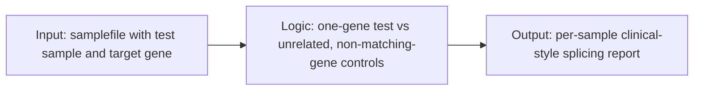
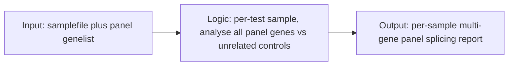
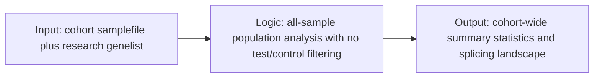

# Cortar Documentation

This folder contains comprehensive documentation for the `cortar()` function and its three analysis modes.

## Documentation Files

### 📖 [Cortar Overview](cortar-overview.md)
Main documentation covering:
- Function parameters and usage
- Sample file format requirements
- Overview of all three analysis modes
- General workflow and output descriptions
- Installation and basic examples

### 🔍 [Default Mode](default-mode.md)
**Single gene analysis for individual patients/probands**
- One gene per test sample
- Family-aware control filtering
- Gene-specific control exclusion
- Individual patient reports
- Clinical diagnostics focus

### 🧬 [Panel Mode](panel-mode.md) 
**Multi-gene panel analysis for targeted gene sets**
- Multiple genes analysed simultaneously
- External genelist specification
- Panel-wide reporting
- Gene panel sequencing applications
- Clinical exome analysis

### 🧪 [Research Mode](research-mode.md)
**Population-level analysis for research studies**
- All samples treated equally
- No test/control distinctions
- Population statistics calculation
- Cohort studies and population genetics
- Reference database development

## Quick Mode Selection Guide

| Use Case | Recommended Mode | Key Features |
|----------|------------------|--------------|
| Single patient, one gene of interest | **Default** | Family filtering, gene-specific controls |
| Gene panel testing | **Panel** | Multi-gene analysis, external genelist |
| Population study | **Research** | No test/control, population statistics |
| Clinical diagnostics | **Default** or **Panel** | Depending on single gene vs panel |
| Method development | **Research** | Equal treatment of all samples |
| Reference database | **Research** | Population-level statistics |

## Core Workflow Snapshots

### Default Mode

### Panel Mode

### Research Mode

## Getting Started

1. **Start with [Cortar Overview](cortar-overview.md)** for general function usage
2. **Choose your mode** based on your analysis goals:
   - Single gene investigation → [Default Mode](default-mode.md)
   - Gene panel analysis → [Panel Mode](panel-mode.md) 
   - Population study → [Research Mode](research-mode.md)
3. **Follow the workflow diagrams** in each mode's documentation
4. **Review the examples** for code implementation

## Support

For additional help:
- Check the troubleshooting sections in each mode's documentation
- Review the examples and best practices
- Refer to the main package README for installation instructions
