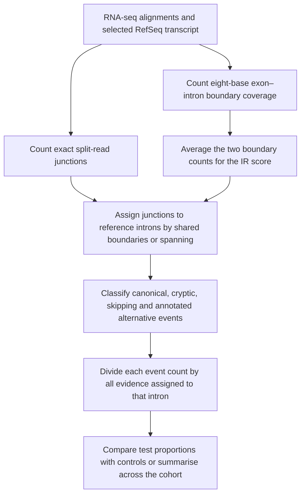

# Cortar methods brief

## Manuscript-ready Methods text

The following text describes Cortar as audited at commit `9f693bd`. The package
metadata at this commit reports version 1.0.0, whereas the repository tag is
0.1.12; this discrepancy should be resolved before publication. Until then, the
exact commit should be reported. Authors should also add the genome assembly,
transcript identifiers, input route, strandedness, `ria` setting, analysis mode
and control thresholds used in their study.

### RNA-splicing event detection and quantification

We analysed RNA-sequencing alignments using Cortar (commit `9f693bd`; package
metadata version 1.0.0) with assembly-specific RefSeq transcript annotation.
Selected RefSeq transcript record(s) defined the reference introns, exon
numbering and canonical splice boundaries. Split-read junctions were identified
from aligned RNA-sequencing reads and grouped by exact genomic junction
coordinates and strand. For precomputed STAR junction input, the uniquely
mapping junction-read count was used. Junctions matching both boundaries of a reference intron were
classified as canonical splicing. Junctions sharing one reference boundary and
using a novel opposing boundary were classified as cryptic donor or acceptor use
according to transcript strand. Junctions connecting boundaries from different
reference introns were classified as exon-skipping events, with the intervening
reference exons reported as skipped. Exact junctions present in a non-selected
RefSeq transcript of the same gene were marked as annotated alternative
splicing unless they also matched a selected reference intron, in which case
canonical status took precedence. Alternative status was relative to the
selected reference transcript and did not replace the event classification.

Intron-retention evidence was estimated independently at the two boundaries of
each reference intron. Each boundary was represented by an eight-nucleotide
window containing four exonic and four intronic bases. A read or read-pair
alignment contributed to a boundary count only when a continuously aligned
segment covered the complete eight-nucleotide window. The intron-retention score
was calculated as the arithmetic mean of the two boundary counts:

\[
IR_{ij}=\frac{L_{ij}+R_{ij}}{2},
\]

where \(L_{ij}\) and \(R_{ij}\) are the two boundary counts for intron \(i\) in
sample \(j\). This procedure measured boundary-spanning evidence rather than
coverage across the complete intron and did not require the same molecule to
support both boundaries. Alignments were not required to be entirely unsplit;
a cryptically split read could also contribute to one IR boundary when one of
its continuously aligned segments covered the corresponding window.

Events were quantified separately for each reference intron. An event was
assigned to an intron when it shared either boundary with that intron. When
reads-in-absentia (`ria`) was enabled, a long junction was also assigned to each
intermediate reference intron that it fully spanned. For event \(r\), sample
\(j\) and reference intron \(i\), Cortar calculated:

\[
P_{ijr}=\frac{C_{ijr}}{\sum_{q\in E_i}C_{ijq}},
\]

where \(C_{ijr}\) is the event's raw junction count, or the averaged boundary
score for intron retention, and \(E_i\) is the complete set of canonical,
cryptic, exon-skipping, alternative-transcript, qualifying unannotated and
intron-retention events assigned to intron \(i\). If no evidence was present in
the event pool, all proportions were set to zero. These values represent
within-intron evidence proportions and are not conventional percent-spliced-in
or transcript-abundance estimates. A long exon-skipping junction could be
reported in several intron contexts, with the same raw junction count but a
different denominator and proportion for each intron.

For one-versus-many analyses, event proportions in each test sample were
compared with the arithmetic mean proportion among eligible controls. Cortar
also calculated the sample standard deviation of control proportions and the
difference between the test proportion and control mean. Events were flagged
when the absolute difference was strictly greater than two, three or four
control standard deviations. In default mode, controls from the same family or
with the same gene label were excluded, and remaining controls were filtered by
their median canonical-junction count across the gene. Controls were retained
only when this median strictly exceeded the specified threshold: 60 for `het`,
30 for `hom` or `hemi`, 0 for a blank setting, or the supplied numeric value. In
panel mode, only same-family samples were excluded and no coverage filter was
applied. In research mode, the arithmetic mean and sample standard deviation
were calculated across all samples, with each sample weighted equally
regardless of read depth.

### Principal limitations

Cortar quantifies the composition of locally assigned alignment evidence rather
than complete transcript isoforms. The proportions are compositional and are not
normalised for library size, gene expression, read length, mappability or
sequence bias. The intron-retention score is an averaged boundary-coverage proxy:
it does not measure intron-body coverage, does not require one molecule to span
both boundaries and can receive evidence from a cryptically split alignment
that also supports a cryptic junction. Event categories depend on exact boundary
matching and on the selected RefSeq transcript; consequently, an event described
as cryptic or exon skipping relative to that transcript may be annotated in
another isoform. Nearby junctions are not clustered, and Cortar does not impose
an event-specific minimum read count, junction-anchor threshold or statistical
significance test. Repeated rows for one exon-skipping junction are not
independent observations. The reported standard-deviation flags are descriptive
thresholds without p-values or multiple-testing correction. Results should
therefore be interpreted as evidence for prioritising candidate splicing events
for alignment review and orthogonal validation, rather than as direct estimates
of transcript abundance, statistical significance or pathogenicity.

## Required study-specific additions

Before inserting the text into a manuscript, report the following details:

- Cortar version and preferably the exact commit;
- genome assembly and sequence naming convention;
- requested genes and the RefSeq transcript ultimately analysed for each gene;
- whether BAM or precomputed STAR/IR input was used;
- paired-end and strandedness settings;
- whether `ria` was enabled;
- default, panel or research mode;
- number of controls contributing to each analysis;
- default-mode coverage setting (`het`, `hom`, `hemi`, blank or numeric);
- upstream aligner, alignment parameters and filtering applied before Cortar;
- how any precomputed IR boundary file was generated;
- manual or orthogonal validation performed for prioritised events.

## Conceptual workflow

## Further detail

- [Exact event definitions and calculations](event-detection-and-quantification.md)
- [Scientific assumptions and limitations](assumptions-and-limitations.md)
- [Default-mode comparison rules](default-mode.md)
- [Panel-mode comparison rules](panel-mode.md)
- [Research-mode aggregation](research-mode.md)
