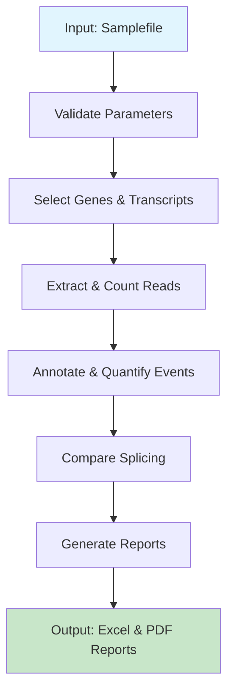

# Cortar Function Documentation

## Overview

`cortar()` is the main function in the cortar package that runs the entire RNA splicing analysis pipeline. It processes RNA-seq data to identify and quantify splicing events, comparing them between test samples and controls to detect aberrant splicing patterns.

## Function Signature

```r
cortar(file,
       mode = "default",
       assembly = "hg38",
       annotation = "UCSC",
       input_type = "bamfile",
       paired = TRUE,
       stranded = 2,
       subset = NULL,
       output_dir = "~",
       genelist = NULL,
       prefix = "",
       debug = FALSE,
       ria = TRUE)
```

## Parameters

- **file**: A file path pointing to the cortar samplefile (see [Sample File Format](#sample-file-format))
- **mode**: One of `"default"`, `"panel"`, or `"research"` (see [Analysis Modes](#analysis-modes))
- **assembly**: Genome assembly used for alignment: `"hg38"` (default) or `"hg19"`
- **annotation**: Annotation used for alignment: `"UCSC"` or `"1000genomes"`
- **input_type**: Type of input data: `"bamfile"` or `"sj"`
- **paired**: Is the RNA-seq paired-end? `TRUE`/`FALSE`
- **stranded**: Strandedness of the RNA-seq: `0` (unstranded), `1` (forward), or `2` (reverse)
- **subset**: Does the RNA-Seq need to be subsetted? `TRUE`/`FALSE` (not currently available)
- **output_dir**: Directory path for export of cortar results
- **genelist**: Character vector with genes/RefSeq transcripts of interest (required for panel/research modes)
- **prefix**: Character string to be appended to the beginning of output file names
- **debug**: Enable debug mode for additional output: `TRUE`/`FALSE`
- **ria**: Reads in absentia - count multi-exon skipping as an event: `TRUE`/`FALSE`

## Sample File Format

The cortar samplefile is a tab-separated file containing the following columns:

| Column | Description |
|--------|-------------|
| sampleID | Unique identifier for the sample |
| familyID | Unique identifier for related samples |
| sampletype | Whether analysis is desired for this sample ("test" or empty) |
| genes | Gene symbol for gene under investigation |
| transcript | Transcript under investigation (optional) |
| bamfile | Absolute or relative file path to the processed bamfile |

Example samplefile:
```
sampleID    familyID   sampletype   genes      transcript       bamfile
proband_1   1          test         DMD        NM_004006        /path/to/proband_1.bam
mother_1    1                       DMD        NM_004006        /path/to/mother_1.bam
control_1   2                       TTN        NM_001267550     /path/to/control_1.bam
```

## Analysis Modes

Cortar supports three distinct analysis modes, each designed for different research scenarios:

### 1. Default Mode
**Purpose**: Single gene analysis for individual patients/probands
- Analyzes one specific gene per test sample
- Compares test samples to family-unrelated controls
- Excludes controls with the same gene under investigation
- Applies coverage filtering for quality control

[→ Detailed Default Mode Documentation](default-mode.md)

### 2. Panel Mode  
**Purpose**: Multi-gene panel analysis for targeted gene sets
- Analyzes multiple genes simultaneously using an external genelist
- Compares test samples to family-unrelated controls (any gene background)
- Suitable for gene panel sequencing analysis
- Uses provided genelist parameter for gene selection

[→ Detailed Panel Mode Documentation](panel-mode.md)

### 3. Research Mode
**Purpose**: Population-level analysis and research studies
- Analyzes all samples without test/control distinction
- Calculates population statistics across all samples
- No family-based filtering
- Suitable for cohort studies and population genetics

[→ Detailed Research Mode Documentation](research-mode.md)

## General Workflow

All three modes follow the same core pipeline with mode-specific variations:



## Output Files

Cortar generates several output files depending on the mode:

### Common Outputs
- **Excel reports**: Detailed splicing analysis results
- **TSV files**: Tab-separated values for further analysis
- **PDF plots**: Visualization of splicing patterns (when applicable)

### Mode-Specific Outputs
- **Default/Panel**: Per-sample reports with family comparisons
- **Research**: Population-level statistics file (`splicing_analysis_combined_full.tsv`)

## Error Handling

The function includes comprehensive error checking for:
- File existence and readability
- Valid parameter values
- Output directory creation
- BAM file accessibility

## Examples

### Basic Usage (Default Mode)
```r
library(cortar)

cortar(
  file = "my_samplefile.tsv",
  mode = "default",
  assembly = "hg38",
  output_dir = "results/"
)
```

### Panel Analysis
```r
cortar(
  file = "panel_samplefile.tsv", 
  mode = "panel",
  genelist = c("DMD", "TTN", "NF1", "CFTR"),
  output_dir = "panel_results/"
)
```

### Research Study
```r
cortar(
  file = "cohort_samplefile.tsv",
  mode = "research", 
  genelist = c("GENE1", "GENE2", "GENE3"),
  output_dir = "research_results/"
)
```

## See Also

- [Default Mode Documentation](default-mode.md)
- [Panel Mode Documentation](panel-mode.md)  
- [Research Mode Documentation](research-mode.md)
- Package README for installation and setup instructions