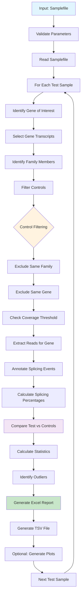

# Default Mode Documentation

## Overview

Default mode is designed for **single gene analysis** where each test sample (proband) is analyzed for one specific gene and compared against family-unrelated control samples. This is the most commonly used mode for clinical diagnostics and case studies.

## Key Characteristics

- **One gene per test sample**: Each proband is analyzed for a specific gene of interest
- **Family-aware filtering**: Controls are excluded if they belong to the same family as the test sample
- **Gene-specific filtering**: Controls are excluded if they have the same gene under investigation
- **Coverage filtering**: Controls with insufficient coverage are automatically excluded
- **Individual reports**: Separate analysis for each test sample

## When to Use Default Mode

- Clinical diagnostics for suspected genetic conditions
- Case studies investigating specific gene variants
- Family-based studies where you want to exclude related individuals from controls
- When you have different genes of interest for different samples

## Sample File Requirements

In default mode, the samplefile must specify:
- **genes**: The specific gene symbol for each sample (required for test samples)
- **sampletype**: Mark test samples with "test", leave controls empty
- **familyID**: Unique identifier to group related samples

### Example Samplefile
```
sampleID    familyID   sampletype   genes      transcript       bamfile
proband_1   family1    test         DMD        NM_004006        /path/to/proband_1.bam
mother_1    family1                 DMD        NM_004006        /path/to/mother_1.bam
father_1    family1                 DMD        NM_004006        /path/to/father_1.bam
proband_2   family2    test         TTN        NM_001267550     /path/to/proband_2.bam
control_1   family3                 NF1        NM_000267        /path/to/control_1.bam
control_2   family4                 CFTR       NM_000492        /path/to/control_2.bam
```

## Workflow

### Detailed Default Mode Pipeline



## Gene Selection Process

1. **Gene specification**: The gene is specified in the samplefile `genes` column for each test sample
2. **Transcript selection**: Uses the specified transcript or defaults to canonical RefSeq transcript
3. **Genomic coordinates**: Retrieves all exons and introns for the gene
4. **Annotation matching**: Matches against the specified genome assembly and annotation

## Control Selection and Filtering

### Family Filtering
- Excludes all samples with the same `familyID` as the test sample
- Prevents comparison with related individuals who may share genetic variants

### Gene Filtering  
- Excludes all controls that have the same gene in their `genes` column
- Prevents comparison with samples that may have pathogenic variants in the same gene

### Coverage Filtering
- Calculates median coverage across canonical exons for each potential control
- Applies coverage thresholds based on expected variant type:
  - **Heterozygous variants**: Minimum 60 reads
  - **Homozygous/Hemizygous variants**: Minimum 30 reads
  - **Unspecified**: No filtering (0 reads)
  - **Custom threshold**: Uses provided numeric value

### Final Control Set
After filtering, remaining samples become the control cohort for statistical comparison.

## Statistical Analysis

### Splicing Event Quantification
1. **Read extraction**: Counts splice junction and intron retention reads
2. **Percentage calculation**: Calculates splicing percentages for each event
3. **Event annotation**: Classifies events as canonical, cryptic, or novel

### Comparison Metrics
- **Control statistics**: Mean, standard deviation, and sample count for controls
- **Difference calculation**: Test sample percentage minus control average
- **Outlier detection**: Events exceeding 2, 3, or 4 standard deviations
- **Unique events**: Events present only in test sample (control average = 0)

### Quality Control
- **Read count thresholds**: Filters low-coverage events
- **Annotation confidence**: Prioritizes well-annotated splice sites
- **Frame conservation**: Identifies frame-preserving vs frame-shifting events

## Output Files

### Per-Sample Outputs
For each test sample, default mode generates:

#### Excel Report (`{sampleID}_{gene}_combined_dt_.xlsx`)
- **Filtered results**: Events exceeding statistical thresholds
- **Color coding**: Visual highlighting of significant events
- **Multiple sheets**: Different significance levels and event types

#### Full TSV File (`{sampleID}_{gene}_combined_full.tsv`)
- **Complete results**: All analyzed splicing events
- **Detailed metrics**: Statistical comparisons and annotations
- **Research format**: Tab-separated for downstream analysis

#### Optional PDF Plots (`{sampleID}_{gene}_normalSpliceMap.pdf`)
- **Splice visualization**: Graphical representation of splicing patterns
- **Control comparisons**: Test sample overlaid on control distribution

### Column Descriptions
Key columns in output files:

| Column | Description |
|--------|-------------|
| gene | Gene symbol |
| event | Splice junction coordinates |
| annotated | canonical/cryptic/novel classification |
| difference | Test percentage - control average |
| unique | Events unique to test sample |
| controlavg | Average percentage in controls |
| controlsd | Standard deviation in controls |
| controln | Number of control samples |
| two_sd, three_sd, four_sd | Statistical significance flags |

## Best Practices

### Sample Selection
- Include adequate numbers of unrelated controls (recommended: >20)
- Ensure controls have similar technical characteristics (library prep, sequencing depth)
- Match tissue types between test and control samples

### Quality Control
- Review coverage statistics before analysis
- Check for batch effects in control populations
- Validate significant findings with orthogonal methods

### Interpretation
- Focus on high-confidence events (canonical splice sites)
- Consider functional impact of frame-shifting events
- Validate novel splice sites with additional evidence

## Troubleshooting

### Common Issues
1. **Insufficient controls**: Increase control sample size
2. **Low coverage**: Adjust coverage thresholds or improve sequencing depth
3. **No significant events**: Consider broader gene panels or different analysis modes

### Error Messages
- **"Gene not found"**: Check gene symbol spelling and genome assembly
- **"No controls remaining"**: Relax filtering criteria or add more control samples
- **"Low coverage"**: Increase sequencing depth or adjust thresholds

## Example Usage

```r
library(cortar)

# Run default mode analysis
cortar(
  file = "clinical_samplefile.tsv",
  mode = "default",
  assembly = "hg38",
  annotation = "UCSC", 
  paired = TRUE,
  stranded = 2,
  output_dir = "clinical_results/",
  prefix = "clinic_"
)
```

## See Also

- [Cortar Overview](cortar-overview.md)
- [Panel Mode Documentation](panel-mode.md)
- [Research Mode Documentation](research-mode.md)