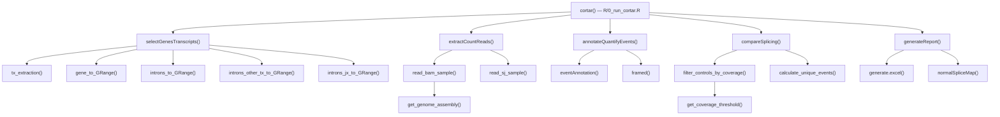

# Developer guide to the cortar codebase

## Who this guide is for

This is the starting point for a developer who has not previously worked with
cortar, RNA splicing or Bioconductor range objects. It explains what the package
is trying to do, how data moves through it, where each function lives, and which
tests should change with each module.

For exact biological calculations, follow this guide with
[event detection and quantification](event-detection-and-quantification.md).
For behaviours that should not be treated as correct merely because they are
implemented, read [assumptions, limitations and known defects](assumptions-and-limitations.md).

## The problem in plain language

Genes contain exons that remain in mature RNA and introns that are normally
removed. An aligned RNA-seq read that crosses an exon-exon boundary contains an
`N` operation in its BAM CIGAR string. That gap represents a putative splice
junction. Reads that remain continuously aligned across an exon-intron boundary
can instead support intron retention.

Cortar does four conceptual things:

1. chooses a reference RefSeq transcript and its canonical introns;
2. counts observed splice junctions and boundary coverage in each sample;
3. assigns and normalises those observations separately at each canonical
   intron;
4. summarises the resulting proportions against controls or across a cohort.

The word “canonical” in this codebase means an exact coordinate match to an
intron in the selected reference transcript. It does not mean that an event is
biologically benign. Similarly, `two_sd`, `three_sd` and `four_sd` are descriptive
flags, not statistical significance tests.

## Vocabulary used in the code

| Term | Meaning in cortar |
|---|---|
| `SJ` | A splice junction extracted from an `N` CIGAR operation or STAR junction row |
| `IR` | Intron-retention proxy: mean read coverage at the two canonical intron boundaries |
| Canonical intron | An intron in the selected RefSeq transcript |
| Alternative intron | An exact intron from another transcript of the same selected gene |
| Event pool | All SJ and IR rows assigned to one canonical intron |
| `count_<sample>` | Raw SJ count or averaged IR boundary count |
| `pct_<sample>` | A count divided by all counts in that sample's current intron event pool |
| RIA | “Reads in absentia”; includes a long skipping junction in internal introns it spans |
| Proband | The current row marked `sampletype == "test"` in default or panel mode |
| Control | A sample selected by mode-specific family/gene rules, regardless of `sampletype` |

## Repository map

```text
R/                  Package implementation; start with 0_run_cortar.R
data/               Bundled hg19/hg38 RefSeq annotation objects and example data
docs/               Behavioural, mode, limitation and validation documentation
inst/               Installed helper scripts and example BAM files
man/                Generated R help pages; edit roxygen comments in R/, not these files
misc/               Experimental or obsolete scripts not run by the package test suite
tests/testthat/      Active automated tests
DESCRIPTION         Package metadata and declared dependencies
NAMESPACE           Generated export/import list
README.Rmd           Source-style project README
README.md            Rendered project README
Dockerfile          Container build definition
graphing.R           Standalone exploratory prototype; not loaded as package code
```

The numbered `R/` filenames express the intended pipeline order. R package
loading does not execute the pipeline in filename order; it defines all
functions, and `cortar()` invokes them at runtime.

## Input sample-table contract

`cortar()` reads a tab-separated file with `data.table::fread()`. There is no
central schema validator, so downstream functions fail at different times when
columns are absent. A developer should treat these as the effective columns:

| Column | Used by | Meaning and caveats |
|---|---|---|
| `sampleID` | every stage | unique sample identifier; embedded verbatim in count/percentage column names |
| `familyID` or `family` | comparison/reporting | exact equality defines family; the code contains both explicit fallback logic and partial-name matching |
| `sampletype` | default/panel comparison and reporting | only exact value `test` triggers a per-sample report; it does not prevent that row acting as another test's control |
| `genes` or `gene` | target and control selection | default target source and same-gene exclusion; `cortar()` itself specifically reads plural `genes` |
| `transcript` | nominal metadata only | currently ignored by the main pipeline |
| `coverage` | default mode | test-row threshold name or number; not used in panel/research |
| `bamfile` | BAM adapter and entry validation | BAM path; currently checked even for SJ input |
| `sjfile` | SJ adapter | STAR `SJ.out.tab` path |
| `irfile` | SJ adapter | six-column IR BED-like path |

Panel and research modes still need sample identifiers and input paths, but take
targets from the separate `genelist` argument. Research mode ignores family and
test labels during aggregation. The main code does not verify unique sample IDs,
required columns, allowed sample labels or path-column consistency before
constructing dynamic columns.

## Main call graph



`cortar_batch()` repeatedly calls `cortar()`. `subsetBamfiles()` and
`run_cortar_test()` are separate utilities. The functions in
`R/99_generate_samplefile.R` form a separate sample-table construction workflow
and are not called by `cortar()`.

## Data flow and object shapes

Understanding the changing object type is the quickest way to navigate the
pipeline.

| Stage | Main object | Shape and important fields |
|---|---|---|
| Input | `data.table` | one row per sample; `sampleID`, family, test label, gene and input paths |
| Selection | named list | gene `GRanges`, canonical intron `GRanges` plus metadata, alternative introns, boundary windows |
| Extraction | `GRanges` | union of SJ and IR ranges; `SJ_IR` and one `count_<sample>` column per sample |
| Annotation | `data.table` | repeated event rows by canonical intron; labels, frame heuristic and `pct_<sample>` columns |
| Comparison: default/panel | list | list position corresponds to sample-table row; non-test positions are `NULL` |
| Comparison: research | `data.table` | one cohort summary table without individual sample columns |
| Reporting | files | mode-dependent TSV, XLSX and PDF outputs |

### `GRanges` mental model

A Bioconductor `GRanges` object is a vector of genomic intervals. Every row has
sequence name, start, end, width and strand. Extra columns are stored in
`mcols(object)`. Cortar relies heavily on `findOverlaps()` with `type = "start"`,
`"end"`, `"equal"` or `"within"`. These comparisons are strand-aware unless
explicitly told otherwise; `*` behaves as an unknown/wildcard strand.

Coordinates in `GRanges` are one-based and inclusive. BED starts are zero-based,
which is why `read_sj_sample()` adds one to the IR BED start. Coordinate
conversion is a high-risk area: test it at exact boundaries whenever it changes.

### `data.table` mental model

`data.table` syntax such as `table[condition, expression, by = group]` combines
filtering, selection and grouping. Assignment with `:=` mutates an object by
reference. A developer expecting ordinary `data.frame` copy semantics can
accidentally change an input owned by the caller. This repository also contains
partial `$` column matching; consult the defect register before adding similarly
prefixed columns.

## Module-by-module guide

### `R/0_run_cortar.R`: orchestration and user utilities

This is the first file to read. It defines the public workflow but contains
almost none of the biological calculation itself.

#### `cortar()`

Purpose: validate a subset of arguments, load the sample table, choose targets,
call each numbered pipeline stage and write reports.

Important branch points:

- default mode selects targets from `file$genes`;
- panel and research modes select targets from `genelist`;
- `input_type == "bamfile"` uses BAMs;
- `input_type == "sj"` uses STAR SJ and external IR files;
- default/panel comparison iterates over test rows;
- research comparison aggregates every sample.

It is side-effect oriented: it writes files and returns no explicit result. To
inspect an intermediate during development, call the lower-level stages
directly. Debug mode was intended to write intermediates but is currently broken
in transcript selection.

#### `cortar_batch()`

Purpose: find matching sample-table files in a folder, create one output folder
per file and call `cortar()` sequentially. Its default `input_type` is `sj`,
which differs from `cortar()`'s `bamfile` default.

#### `subsetBamfiles()`

Purpose: convert bundled RefSeq gene spans to BED-style intervals for external
BAM/CRAM subsetting. Despite its name, it prints and invisibly returns
coordinates; it does not open a BAM. `inst/subsetBamfiles.sh` performs the actual
samtools subsetting.

#### `run_cortar_test()`

Purpose: copy packaged example BAMs to a local `cortar_test` folder, rewrite the
sample paths and run the pipeline. This is a user smoke test, distinct from the
automated `testthat` suite.

### `R/1_select_gene_and_transcript.R`: reference model construction

This module converts requested identifiers into the genomic ranges that define
all downstream analysis.

#### `selectGenesTranscripts()`

Purpose: façade for this stage. It selects the correct bundled annotation table
and returns the four range collections needed by extraction and annotation.

#### `tx_extraction()`

Purpose: recognise gene IDs, gene symbols and `NM_` transcript accessions, then
resolve them to `(gene_name, tx_version_id)` pairs. Gene-level inputs keep rows
marked canonical. Empty identifiers are skipped.

This function determines transcript choice. The sample table's separate
`transcript` column never reaches it.

#### `gene_to_GRange()`

Purpose: create one extraction span per resolved transcript using the minimum
and maximum coordinates of its exon rows. These spans restrict which BAM records
are loaded.

#### `introns_to_GRange()`

Purpose: create the canonical intron ranges and attach `intron_no` and `gene`.
It returns both the `GRanges` used for overlaps and the annotation `data.table`
used later for labels.

#### `introns_other_tx_to_GRange()`

Purpose: collect introns from non-selected transcripts of the same genes. Exact
matches against these ranges receive `annotated = "alternative"` later.

#### `introns_jx_to_GRange()`

Purpose: construct the two eight-base boundary windows for every canonical
intron. These are used only for BAM-derived IR coverage.

When changing this module, run `test-1_select_gene_and_transcript.R` and add
tests for every identifier or coordinate rule changed.

### `R/2_extract_count_reads.R`: observations to raw counts

This module has two input adapters and then creates a common cross-sample event
representation.

#### `extractCountReads()`

Purpose: choose the BAM or SJ adapter for every sample; union exact SJ and IR
ranges across samples; and attach `count_<sampleID>` columns, filling absent
events with zero.

The returned `GRanges` is the contract between extraction and annotation. Any
new evidence field that should survive must be deliberately retained in
`mcols()`; several fields are currently deleted before return.

#### `read_bam_sample()`

Purpose: load mapped alignments in selected gene spans, calculate eight-base
boundary overlap counts for IR, and call `summarizeJunctions()` for CIGAR-derived
SJs. Paired and single-end inputs use different Bioconductor readers.

The SJ `score` is supplied by `summarizeJunctions()`. The IR `ir_score` is
`(start_boundary_count + end_boundary_count) / 2`.

#### `read_sj_sample()`

Purpose: translate a nine-column STAR `SJ.out.tab` and six-column IR BED-like
file into the same SJ/IR `GRanges` contract. It uses STAR unique-read counts and
ignores STAR multi-mapping counts.

The active extraction tests cover the precomputed-file adapter but do not yet
provide a comprehensive direct-BAM truth table. Use the
[synthetic BAM validation plan](synthetic-bam-test-plan.md) when changing this
module.

### `R/3_annotate_quantify_events.R`: the core biological logic

This is the most important file for understanding what a result means.

#### `annotateQuantifyEvents()`

Purpose: loop over every canonical intron, collect events sharing or spanning
its boundaries, label exact canonical/alternative matches, and calculate each
sample's local event proportions. Because the loop is intron-centred, one
junction can be emitted in multiple intron contexts.

#### `eventAnnotation()`

Purpose: turn matched start/end intron numbers and strand into descriptions such
as canonical splicing, intron retention, exon skipping and cryptic donor or
acceptor use. This function labels coordinates; it does not evaluate biological
pathogenicity.

#### `framed()`

Purpose: apply a coordinate divisibility-by-three heuristic to SJ rows. It is
not a CDS-aware reading-frame analysis. Do not extend or rely on it without first
constraining comparisons by chromosome, gene, strand, transcript and coding
phase.

The exact membership rules, denominator and labels are documented in
[event detection and quantification](event-detection-and-quantification.md).

### `R/4_compare_splicing.R`: mode-specific sample summaries

This module does not discover new events. It summarises already calculated
`pct_` and `count_` columns.

#### `compareSplicing()`

Purpose: select family and control columns, calculate row-wise control/cohort
means and SDs, add differences and SD flags, order columns, and return the table
shape expected by reporting.

Default and panel modes return a list indexed like the sample table. Research
mode returns one `data.table`; this type difference is important to callers.

#### `filter_controls_by_coverage()`

Purpose: in default mode only, keep controls whose median canonical SJ raw count
for the test gene is strictly greater than the configured threshold.

#### `calculate_unique_events()`

Purpose: for events with zero control mean, report how many family members,
including the proband, have non-zero proportions.

Read the separate [default](default-mode.md), [panel](panel-mode.md) and
[research](research-mode.md) documents before altering this module.

### `R/5_generate_report.R`: output formatting

This module should format comparison results rather than change their meaning.

#### `generateReport()`

Purpose: choose filenames and mode-specific output types. Default/panel produce
per-test TSV and Excel files. Research produces one cohort TSV and two PDF files
per gene.

#### `normalSpliceMap()`

Purpose: plot canonical SJ proportions across intron numbers. Plot creation is
disabled for default/panel by a local hard-coded flag and active for research.
The research bar plot receives a zeroed `difference`, so it is not an outlier
plot.

#### `generate.excel()`

Purpose: write the comparison table to one worksheet and apply styles by fixed
column positions. Adding, removing or reordering comparison columns can make the
formatting target the wrong data even when file generation still succeeds.

### `R/99_generate_samplefile.R`: separate sample-table builder

This module is not part of the main call graph and none of its functions are
exported in `NAMESPACE`.

| Function | Purpose |
|---|---|
| `generate_sample_metadata()` | Package user-supplied metadata into one `data.table` row |
| `create_new_samplefile()` | Read an external sample database, select controls, build paths and optionally write a table |
| `generate_paths()` | Return BAM, STAR SJ and IR paths for a test sample |
| `select_controls()` | Filter an external database by age, assembly, RNA-seq type, tissue, treatment, gene and optional sex; then add family rows |
| `generate_samplefile()` | Combine one test row with selected controls |
| `export_samplefile()` | Write the table as TSV |
| `generate_bam_path()` | Construct the expected BAM path convention |
| `generate_sj_path()` | Construct the expected STAR SJ path convention |
| `generate_ir_path()` | Construct the expected IR path convention |

The only apparent tests are in `misc/test-99_generate_samplefile.R`, not
`tests/testthat/`, and depend on a hard-coded external volume. They are not run by
`devtools::test()`. Treat this module as unverified, environment-specific support
code until it has self-contained active tests.

### `R/utils.R`: shared constants and small helpers

| Symbol | Purpose |
|---|---|
| `%nin%` | Negated `%in%` operator |
| `DEFAULT_COVERAGE_HET` | Default threshold 60 |
| `DEFAULT_COVERAGE_HOM_HEMI` | Default threshold 30 |
| `DEFAULT_COVERAGE_NONE` | Default threshold 0 |
| `INTRON_JUNCTION_UPSTREAM` | Four bases before a boundary coordinate |
| `INTRON_JUNCTION_DOWNSTREAM` | Three bases after a boundary coordinate, producing an eight-base inclusive window |
| `MIN_JUNCTION_OVERLAP` | Eight bases required for IR boundary overlap; despite the name, not applied to SJs |
| `is_debug_enabled()` | True only for a non-empty character path |
| `get_coverage_threshold()` | Map named or numeric sample settings to a threshold |
| `get_genome_assembly()` | Return the BSgenome object used by BAM junction summarisation |

Changes to constants can alter every result and should be accompanied by
fixture regeneration and an explicit migration note.

## Public API versus internal functions

`NAMESPACE` currently exports:

- `cortar()`;
- `cortar_batch()`;
- `extractCountReads()`;
- `run_cortar_test()`;
- `selectGenesTranscripts()`;
- `subsetBamfiles()`;
- `tx_extraction()`.

All other functions are internal even when they have generated `.Rd` pages.
During development, `devtools::load_all()` makes internal functions visible in
the working session, which is why tests can call them directly. An installed
package user would normally need `cortar:::` for an internal function. Avoid
exporting more functions merely to make tests convenient; test internal logic
within the package test environment.

## Bundled data and external dependencies

The `data/` directory contains the annotation state that defines the analysis:

- `refseq_introns_exons_hg19.rda`;
- `refseq_introns_exons_hg38.rda`;
- two Ensembl-labelled objects that are currently not used by the main pipeline;
- an example sample-table object.

Changing an annotation `.rda` file can change transcript choice, intron numbers,
event labels and every golden result without changing R source. Record its
checksum and provenance whenever it is regenerated.

Major runtime responsibilities are split across:

- `data.table` for tables and joins;
- `GenomicRanges`/`IRanges` for interval matching;
- `GenomicAlignments`/`Rsamtools` for BAM loading, pairing and junction counts;
- `BSgenome.*` for reference sequence and splice-motif strand inference;
- `ggplot2` for PDFs;
- `openxlsx` for workbooks.

`DESCRIPTION` should be the dependency authority, but the code also uses
namespaces such as `Rsamtools`, `IRanges`, `GenomeInfoDb`, `S4Vectors`,
`BiocGenerics`, `futile.logger` and `stringr` that are not all declared directly.
An R package check should be used to reconcile this rather than assuming a
developer's installed library set is sufficient.

## Command-line and installed helpers

- `inst/run_cortar.sh` is an `optparse` wrapper around `cortar()`. Its default
  `ria = FALSE` differs from the R function's `TRUE` default.
- `inst/subsetBamfiles.sh` calls `inst/get_genes_coords.R`, then uses samtools to
  subset, sort and index BAM/CRAM files.
- `inst/run_tests.sh` runs `devtools::test()`.
- `inst/extdata/` contains the files copied by `run_cortar_test()`.

Files under `inst/` are installed with the package. They are operational entry
points and should be kept consistent with the R API defaults.

`graphing.R` is an exploratory script tied to a local `temp/debug` path. It is
not sourced by the package, references a variable before defining it, and uses
logic that differs from `generateReport()`. Do not treat it as production code.

## Test suite map

| Test file | Primary coverage |
|---|---|
| `test-0_cortar.R` | one EMD BAM end-to-end golden TSV; batching; subsetting utility |
| `test-1_select_gene_and_transcript.R` | identifier resolution and range construction |
| `test-2_extract_count_reads.R` | STAR SJ/IR parsing and empty precomputed files |
| `test-3_annotate_quantify_events.R` | event label helper and frame helper |
| `test-4_compare_splicing.R` | modes, ordering, uniqueness and coverage filtering |
| `test-5_generate_report.R` | default-mode Excel/TSV filenames and column preservation |
| `test-utils.R` | constants/helpers and supported BSgenome combinations |
| `helper-test-fixtures.R` | fixture path resolution and compatibility columns |

The suite does not yet directly ground-truth the complete BAM extraction and
`annotateQuantifyEvents()` denominator across all event classes. A passing suite
therefore demonstrates regression stability, not full biological validation.

## How to trace one result row

When investigating a surprising output row, follow this order:

1. In the final TSV, note `gene`, `intron_no`, coordinates, strand and `SJ_IR`.
2. Reproduce or capture the `extractCountReads()` result and inspect every
   `count_<sample>` at those exact coordinates.
3. In `annotateQuantifyEvents()`, identify why the row joined the current intron:
   equal start, equal end or RIA containment.
4. List every other row in the same gene/intron event pool and recompute the
   `pct_` denominator manually.
5. Check exact canonical and alternative intron equality before interpreting
   `annotated`.
6. Recompute control membership from family ID, gene and coverage rules.
7. Recompute mean, sample SD and difference independently.
8. Only then inspect report formatting.

This sequence separates extraction, annotation, normalisation, cohort selection
and presentation faults instead of debugging the final workbook as one opaque
operation.

## Where to make common changes

| Desired change | Primary module | Also inspect |
|---|---|---|
| Accept a new identifier or transcript rule | `R/1_select_gene_and_transcript.R` | bundled annotation schema, sample-table docs and selection tests |
| Change BAM flags or minimum evidence | `R/2_extract_count_reads.R` | paired/strand behaviour and synthetic BAM fixtures |
| Change what belongs in an event denominator | `R/3_annotate_quantify_events.R` | every percentage golden file and comparison output |
| Add or rename an event category | `eventAnnotation()` | strand cases, reports and downstream consumers |
| Replace frame prediction | `framed()` | annotation inputs and output column type |
| Change control eligibility | `R/4_compare_splicing.R` | all three mode docs and comparison tests |
| Add statistical testing | new focused module plus `R/4_compare_splicing.R` | multiple testing, minimum sample size, report schema and validation plan |
| Add output columns | `R/4_compare_splicing.R` and `R/5_generate_report.R` | fixed Excel styling column indices |
| Change filenames or plots | `R/5_generate_report.R` | CLI/user docs and report tests |
| Change package entry arguments | `R/0_run_cortar.R` | `inst/run_cortar.sh`, roxygen docs and validation |
| Change bundled annotation | `data/` generation process | checksums, transcript/intron snapshots and every end-to-end fixture |

## Safe development workflow

1. Read this guide and the behavioural document for the module being changed.
2. Reproduce the current behaviour with the smallest relevant test.
3. Add a focused failing test with independently calculated expected values.
4. Make the implementation change in one stage where possible.
5. Run the focused test, then `Rscript -e 'devtools::test()'`.
6. Run an R package check when dependencies, exports, documentation or installed
   scripts change.
7. Inspect raw TSV values before trusting workbook styling or plots.
8. Update the limitation register when retaining a surprising behaviour by
   design.

Do not update a golden output merely because the implementation changed. First
explain why the new biological and numerical result is correct, then encode that
expectation independently.

## Suggested reading order

For a new maintainer:

1. this guide;
2. [manuscript-ready methods brief](cortar-overview.md);
3. `R/0_run_cortar.R`;
4. `R/1_select_gene_and_transcript.R` and `R/2_extract_count_reads.R`;
5. [event detection and quantification](event-detection-and-quantification.md)
   beside `R/3_annotate_quantify_events.R`;
6. the mode document relevant to your work beside `R/4_compare_splicing.R`;
7. `R/5_generate_report.R`;
8. [assumptions and defects](assumptions-and-limitations.md);
9. [synthetic validation plan](synthetic-bam-test-plan.md) before changing
   scientific logic.
