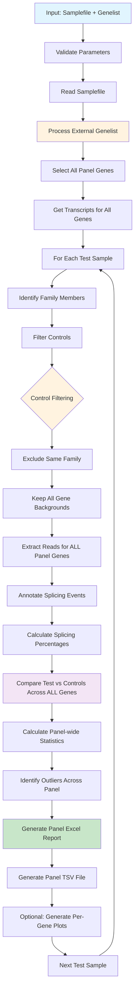

# Panel Mode Documentation

## Overview

Panel mode is designed for **multi-gene panel analysis** where multiple genes are analyzed simultaneously using an external gene list. This mode is ideal for targeted gene panel sequencing, clinical exome analysis, or research studies focusing on specific gene sets.

## Key Characteristics

- **Multiple genes**: Analyzes all genes specified in the external genelist parameter
- **External gene specification**: Uses `genelist` parameter instead of samplefile genes column
- **Family-aware filtering**: Controls are excluded if they belong to the same family as test samples
- **No gene-specific filtering**: Controls can have any gene background (unlike default mode)
- **Panel-wide reports**: Generates comprehensive reports across all genes in the panel

## When to Use Panel Mode

- Gene panel sequencing analysis (e.g., cardiac, neurological, cancer panels)
- Clinical exome analysis with targeted gene lists
- Research studies investigating specific biological pathways
- Multi-gene diagnostic testing
- When you want to analyze the same gene set across multiple patients

## Sample File Requirements

In panel mode, the samplefile structure differs from default mode:
- **genes**: Can be any gene symbol or left empty (not used for analysis)
- **sampletype**: Mark test samples with "test", leave controls empty  
- **familyID**: Unique identifier to group related samples
- **genelist parameter**: External list defines genes to analyze

### Example Samplefile
```
sampleID    familyID   sampletype   genes      transcript       bamfile
proband_1   family1    test         ANY        ANY              /path/to/proband_1.bam
mother_1    family1                 ANY        ANY              /path/to/mother_1.bam
proband_2   family2    test         ANY        ANY              /path/to/proband_2.bam
control_1   family3                 TTN        NM_001267550     /path/to/control_1.bam
control_2   family4                 NF1        NM_000267        /path/to/control_2.bam
control_3   family5                 CFTR       NM_000492        /path/to/control_3.bam
```

### Gene List Parameter
```r
# Example genelist for cardiac panel
cardiac_genes <- c("DMD", "TTN", "MYH7", "MYBPC3", "TNNT2", "TNNI3", "TPM1", "ACTC1")

cortar(
  file = "panel_samplefile.tsv",
  mode = "panel", 
  genelist = cardiac_genes,
  output_dir = "cardiac_panel_results/"
)
```

## Workflow

### Detailed Panel Mode Pipeline



## Gene Selection Process

### External Gene List
1. **Parameter specification**: Genes are provided via the `genelist` parameter
2. **Gene validation**: Each gene is validated against the reference annotation
3. **Transcript selection**: Uses canonical transcripts for each gene
4. **Coordinate retrieval**: Gets genomic coordinates for all genes simultaneously

### Supported Gene Identifiers
The genelist can contain:
- **Gene symbols**: `c("DMD", "TTN", "NF1")`
- **RefSeq transcripts**: `c("NM_004006", "NM_001267550")`
- **Ensembl gene IDs**: `c("ENSG00000198947", "ENSG00000155657")`

## Control Selection and Filtering

### Family Filtering Only
Unlike default mode, panel mode uses simplified control filtering:

1. **Family exclusion**: Removes samples with same `familyID` as test sample
2. **No gene filtering**: Controls with any gene background are included
3. **Coverage filtering**: Applied across all panel genes collectively

### Rationale for Simplified Filtering
- **Broader control base**: Maximizes control sample size
- **Panel-wide analysis**: Assumes pathogenic variants are rare across the panel
- **Statistical power**: Larger control groups improve statistical confidence

## Statistical Analysis

### Panel-Wide Event Quantification
1. **Multi-gene read extraction**: Processes all panel genes simultaneously
2. **Comprehensive event detection**: Identifies splicing events across entire panel
3. **Cross-gene normalization**: Consistent analysis parameters across genes

### Comparison Metrics
- **Panel-wide controls**: Same control cohort used for all genes
- **Gene-specific statistics**: Separate statistics calculated per gene
- **Cross-gene outlier detection**: Identifies samples with multiple affected genes
- **Panel-level summaries**: Overall splicing burden across the panel

### Quality Control
- **Gene coverage balance**: Ensures adequate coverage across all panel genes
- **Cross-gene consistency**: Validates consistent library preparation
- **Batch effect detection**: Identifies systematic biases across genes

## Output Files

### Per-Sample Panel Outputs
For each test sample, panel mode generates:

#### Panel Excel Report (`{sampleID}_panel_combined_dt_.xlsx`)
- **Multi-gene results**: Events across all panel genes
- **Gene-stratified sheets**: Separate analysis per gene
- **Panel summary**: Overview of significant events across genes
- **Pathway analysis**: Functional grouping of affected genes

#### Full Panel TSV File (`{sampleID}_panel_combined_full.tsv`)
- **Complete panel results**: All events across all genes
- **Gene annotations**: Additional gene-level metadata
- **Cross-gene comparisons**: Panel-wide statistical summaries

#### Per-Gene PDF Plots (`{sampleID}_{gene}_normalSpliceMap.pdf`)
- **Individual gene plots**: Separate visualization for each panel gene
- **Consistent formatting**: Standardized plots across genes
- **Control overlays**: Test sample patterns vs. control distributions

### Enhanced Output Columns
Additional columns specific to panel mode:

| Column | Description |
|--------|-------------|
| panel_rank | Ranking of events across entire panel |
| gene_burden | Number of significant events per gene |
| panel_score | Composite score across all panel genes |
| pathway | Functional pathway annotation |

## Analysis Strategies

### Targeted Panels
- **Clinical panels**: Pre-defined gene sets for specific conditions
- **Pathway panels**: Genes involved in specific biological processes
- **Literature panels**: Genes from published association studies

### Quality Assessment
- **Gene coverage uniformity**: Ensure consistent sequencing across panel
- **Control population matching**: Verify appropriate control selection
- **Panel validation**: Cross-reference with known pathogenic variants

### Interpretation Approaches
- **Gene-level analysis**: Focus on individual genes with known associations
- **Pathway-level analysis**: Consider functional relationships between genes
- **Burden testing**: Evaluate overall mutational load across panel

## Best Practices

### Panel Design
- Include well-characterized genes with known disease associations
- Balance panel size (typically 50-500 genes for optimal analysis)
- Consider gene size and exon structure for coverage planning

### Sample Requirements
- Ensure adequate control sample size (recommended: >50 for panels)
- Match tissue types and technical parameters
- Include population-matched controls when possible

### Quality Control
- Monitor gene coverage uniformity across panel
- Validate panel performance with known positive controls
- Regular updates to gene lists based on new discoveries

## Troubleshooting

### Common Issues
1. **Uneven gene coverage**: Optimize capture design or sequencing depth
2. **Large panel complexity**: Consider sub-panel analysis or filtering
3. **Control population biases**: Ensure diverse, well-matched controls

### Performance Optimization
- **Memory management**: Large panels may require increased memory allocation
- **Processing time**: Consider parallel processing for large gene sets
- **Storage requirements**: Plan for increased output file sizes

## Example Usage

### Cardiac Panel Analysis
```r
library(cortar)

# Define cardiac gene panel
cardiac_panel <- c(
  "DMD", "TTN", "MYH7", "MYBPC3", "TNNT2", "TNNI3", 
  "TPM1", "ACTC1", "MYL2", "MYL3", "ACTN2", "CSRP3"
)

# Run panel analysis
cortar(
  file = "cardiac_patients.tsv",
  mode = "panel",
  genelist = cardiac_panel,
  assembly = "hg38",
  output_dir = "cardiac_results/",
  prefix = "cardiac_panel_"
)
```

### Neurological Panel Analysis
```r
# Define neurological gene panel
neuro_panel <- c(
  "DMD", "SMN1", "SMN2", "DMPK", "CNBP", "ATN1", 
  "HTT", "FXN", "ATXN1", "ATXN2", "ATXN3", "CACNA1A"
)

# Run analysis with custom parameters
cortar(
  file = "neuro_cohort.tsv", 
  mode = "panel",
  genelist = neuro_panel,
  assembly = "hg38",
  stranded = 2,
  output_dir = "neuro_results/",
  debug = TRUE
)
```

## See Also

- [Cortar Overview](cortar-overview.md)
- [Default Mode Documentation](default-mode.md)
- [Research Mode Documentation](research-mode.md)