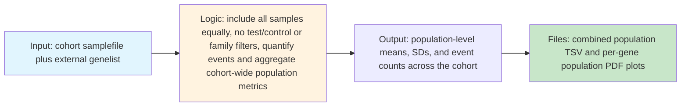
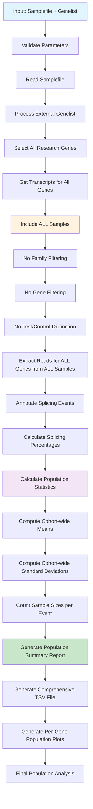

# Research Mode Documentation

## Overview

Research mode is designed for **population-level analysis** and **exploratory research studies** where all samples are treated equally without test/control distinctions. This mode calculates population statistics across all samples and is ideal for cohort studies, population genetics research, and splicing landscape characterisation.

## Key Characteristics

- **No test/control distinction**: All samples are analysed equally
- **Population-level statistics**: Calculates means, standard deviations across entire cohort
- **External gene specification**: Uses `genelist` parameter for gene selection
- **No family filtering**: Includes all samples regardless of family relationships
- **Cohort-wide outputs**: Single comprehensive report for entire study population

## When to Use Research Mode

- Population genetics studies investigating splicing variation
- Cohort studies characterising splicing landscapes
- Method development and validation studies  
- Exploratory analysis of new datasets
- Reference population establishment
- Comparative genomics studies across populations

## Sample File Requirements

In research mode, the samplefile structure is simplified:
- **sampletype**: Not used (all samples treated equally)
- **genes**: Not used for analysis (can be any value)
- **familyID**: Not used for filtering (can be any value)
- **genelist parameter**: Defines genes to analyse across all samples

### Example Samplefile
```
sampleID    familyID   sampletype   genes      transcript       bamfile
sample_001  pop1                    ANY        ANY              /path/to/sample_001.bam
sample_002  pop1                    ANY        ANY              /path/to/sample_002.bam
sample_003  pop2                    ANY        ANY              /path/to/sample_003.bam
sample_004  pop2                    ANY        ANY              /path/to/sample_004.bam
sample_005  pop3                    ANY        ANY              /path/to/sample_005.bam
```

### Gene List Parameter
```r
# Example genelist for research study
research_genes <- c("DMD", "TTN", "NF1", "CFTR", "BRCA1", "BRCA2", "TP53")

cortar(
  file = "population_study.tsv",
  mode = "research",
  genelist = research_genes, 
  output_dir = "population_results/"
)
```

## Workflow

### Core Workflow (Input → Logic → Output)



### Detailed Research Mode Pipeline



## Gene Selection Process

### Population-Level Gene Analysis
1. **External gene list**: All genes specified in `genelist` parameter
2. **Cohort-wide analysis**: Same genes analysed across entire population
3. **No individual gene assignment**: Unlike default mode, no per-sample gene specification
4. **Comprehensive coverage**: All genes analysed for all samples

## Statistical Analysis Approach

### Population Statistics
Research mode calculates fundamentally different statistics compared to other modes:

#### Core Metrics
- **Population mean**: Average splicing percentage across all samples
- **Population standard deviation**: Variation in splicing across population
- **Sample count**: Number of samples with data for each event
- **Population range**: Minimum and maximum values observed

#### No Outlier Detection
- **No statistical testing**: No comparison between test vs control groups
- **No significance thresholds**: No outlier identification (2σ, 3σ, 4σ)
- **Descriptive statistics only**: Focus on population distribution characteristics

### Data Processing
1. **Inclusive analysis**: All samples contribute to statistics
2. **Event-level aggregation**: Statistics calculated per splicing event
3. **Gene-level summaries**: Population parameters summarised per gene
4. **Quality filtering**: Standard read count and coverage filters still apply

## Output Files

### Population-Level Outputs
Research mode generates cohort-wide summary files:

#### Population TSV File (`splicing_analysis_combined_full.tsv`)
- **Complete population data**: All events across all genes and samples
- **Population statistics**: Mean, SD, sample count for each event
- **Individual sample data**: Raw percentages for each sample
- **Gene annotations**: Comprehensive annotation for all events

#### Per-Gene PDF Plots (`splicing_analysis_{gene}_normalSpliceMap.pdf`)
- **Population distributions**: Splicing patterns across entire cohort
- **No individual highlighting**: All samples shown equally
- **Reference patterns**: Population-level splicing landscapes

### Key Output Columns
Research mode output contains population-focused columns:

| Column | Description |
|--------|-------------|
| gene | Gene symbol |
| event | Splice junction coordinates |
| annotated | canonical/cryptic/novel classification |
| controlavg | Population mean percentage |
| controlsd | Population standard deviation |
| controln | Number of samples with data |
| controlavgreads | Population mean read count |
| sample_001_pct | Individual sample percentages |
| sample_001_count | Individual sample read counts |

### Missing Columns
Research mode does not include:
- `difference` (no test vs control comparison)
- `unique` (no individual outlier identification)
- `two_sd`, `three_sd`, `four_sd` (no significance testing)
- `proband` (no individual sample focus)

## Research Applications

### Population Genetics Studies
- **Splicing variation characterisation**: Map normal splicing variation
- **Population stratification**: Identify population-specific splicing patterns
- **Allele frequency estimation**: Estimate frequencies of splicing alleles
- **Evolutionary analysis**: Study splicing conservation across populations

### Reference Population Development
- **Control databases**: Establish reference splicing frequencies
- **Normal variation boundaries**: Define expected splicing ranges
- **Technical validation**: Assess platform-specific biases
- **Quality control standards**: Develop QC metrics for future studies

### Method Development
- **Algorithm validation**: Test splicing detection algorithms
- **Parameter optimisation**: Optimise analysis parameters
- **Batch effect assessment**: Identify and correct technical artefacts
- **Cross-platform comparison**: Compare different sequencing platforms

## Best Practices

### Study Design
- **Sample size**: Include adequate numbers for population statistics (recommended: >100)
- **Population representation**: Ensure diverse, representative sampling
- **Technical standardisation**: Minimise batch effects across samples
- **Metadata collection**: Collect relevant demographic and technical variables

### Data Quality
- **Uniform processing**: Apply consistent analysis pipelines
- **Coverage assessment**: Ensure adequate sequencing depth across genes
- **Quality filtering**: Remove low-quality samples that could bias population statistics
- **Outlier investigation**: Investigate but don't automatically exclude outliers

### Statistical Considerations
- **Multiple testing**: Consider correction for multiple comparisons if needed
- **Population structure**: Account for population stratification
- **Technical confounders**: Model batch effects and technical variables
- **Missing data**: Handle samples with incomplete data appropriately

## Troubleshooting

### Common Issues
1. **Heterogeneous populations**: Consider population stratification
2. **Batch effects**: Implement batch correction methods
3. **Large dataset complexity**: Use efficient computing resources
4. **Storage requirements**: Plan for large output files

### Performance Optimisation
- **Memory management**: Research mode can require significant memory
- **Parallel processing**: Consider parallelisation for large cohorts
- **Data storage**: Implement efficient data storage solutions
- **Computational resources**: Ensure adequate computing infrastructure

## Example Usage

### Population Study
```r
library(cortar)

# Define genes of interest for population study
population_genes <- c(
  "DMD", "TTN", "NF1", "CFTR", "BRCA1", "BRCA2", 
  "TP53", "APC", "MLH1", "MSH2", "MSH6", "PMS2"
)

# Run population analysis
cortar(
  file = "population_cohort.tsv",
  mode = "research", 
  genelist = population_genes,
  assembly = "hg38",
  output_dir = "population_results/",
  prefix = "pop_study_"
)
```

### Method Development Study
```r
# Compare splicing detection across platforms
platform_genes <- c("ACTB", "GAPDH", "RPL19", "RPS18")

cortar(
  file = "platform_comparison.tsv",
  mode = "research",
  genelist = platform_genes,
  assembly = "hg38",
  output_dir = "method_validation/",
  debug = TRUE,
  prefix = "platform_"
)
```

### Large Cohort Analysis
```r
# Comprehensive splicing landscape study
landscape_genes <- c(
  # Add 100+ genes for comprehensive analysis
  "DMD", "TTN", "NF1", "CFTR", "BRCA1", "BRCA2",
  # ... additional genes
)

cortar(
  file = "large_cohort.tsv",
  mode = "research",
  genelist = landscape_genes,
  assembly = "hg38", 
  output_dir = "landscape_study/",
  prefix = "landscape_"
)
```

## Data Interpretation

### Population Statistics
- **Mean values**: Represent typical splicing levels in the population
- **Standard deviations**: Indicate natural variation in splicing
- **Sample counts**: Show data availability and reliability
- **Range values**: Identify extreme splicing patterns

### Quality Assessment
- **Coverage uniformity**: Ensure consistent data quality across samples
- **Distribution normality**: Assess whether splicing follows expected distributions
- **Outlier patterns**: Investigate samples with unusual splicing profiles
- **Technical artefacts**: Identify and address systematic biases

## See Also

- [Cortar Overview](cortar-overview.md)
- [Default Mode Documentation](default-mode.md)
- [Panel Mode Documentation](panel-mode.md)
